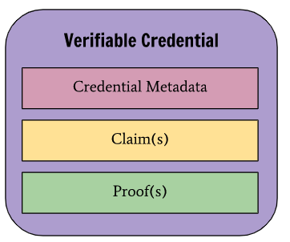

# Hello World to Verifiable Credentials

Verifiable credentials (VCs) are the translation of physical credentials like a driving licence or a degree in the digital world.

Relying on cryptographic proofs enables several advantages:

- Impossible to fake
- Scalable since digital (for all the actor involved)
- Enables minimum disclosure

This last point may be fuzzy because we never do it in the physical world. Let’s take an example.

Let’s say you are asked to prove you are an adult. By showing your ID, you actually reveal much more than a binary “I’m an adult” or “I’m an minor”.

You reveal:

- Your exact age
- Your name
- Your address

## 🕹️ Who’s playing?

There are three roles involve with any type of credential:

- The **Issuer**: creation of the credential
- The **Subject**: The credential is about them. They receive it, hold it and share it with the Verifiers.
- The **Verifier**: Receive and verify the proofs from Subjects.

<p align="center" >
  
</p>

Now let’s take a close (technical 🤓) look at each of the role.

## Part I: The Issuance

Let’s say the issuer is my university. I just graduated and I get issued a degree:

```json
{
  "age": 24,
  "universityName": "Oxford",
  "degree": "Bachelor of Science"
}
```

The above is the *claim* of the credential.

<p align="center" >
  
</p>

Our next goal is to get the issuer to *sign* this claim. This signature will be the proof.

To do so, the issuer needs two things:

1. To have a digital presence. Which is represented cryptographically by a public and private key.
2. To know *who* is the subject. In digital terms, what’s the public key of the *subject*.

```go
type KeyPair struct {
	PublicKey  ed25519.PublicKey
	PrivateKey ed25519.PrivateKey
}

type Issuer struct {
	keys KeyPair

	ID   string
	Name string
}

type Subject struct {
	keys KeyPair
}
```

This is enough to get our first verifiable credential signed 🚀

1. An issuer, meaning a public and a private key
2. The public key of the subject. (Below this is the `subjectID`.)
3. A claim

```go
func (i Issuer) SignCredential(claim Claim, subjectID []byte) (Credential, error) {
	creds := Credential{
		Context:          vcContext,
		TypeOfCredential: append(claim.GetType(), vcType),
		Issuer:           i,
		IssuanceDate:     time.Now(),
		CredentialSubject: CredentialSubject{
			ID:    subjectID,
			Claim: claim,
		},
	}

	creds.Proof = SignProof(i.keys, creds.ToBytes())
	return creds, err
}

func SignProof(keys KeyPair, docToSign) Proof {
	proof := Proof{
		TypeOfProof: ed25519Type,
		Created:     time.Now(),
		Creator:     keys.PublicKey,
	}

	proof.Signature = ed25519.Sign(keys.PrivateKey, docToSign)

	return proof
}
```

The output would look like:

```json
{
  "context": [   
    "https://www.w3.org/2018/credentials/v1"
  ], 
  "type": [    
    "GraduationCredential",
    "VerifiableCredential"   
  ],  
  "issuer": {     
    "ID": "https://oxford.com/issuers/1",
    "Name": "The Marvelous University of Oxford"           
  },   
  "issuanceDate": "2022-01-11T16:49:46.424839+01:00",
  "credentialSubject": {          
    "id": "CmwdBhPLKTvX8EeaUFnRsHJ/UXspbvU4o3DDPnRK8Ws=",
    "claim": {
      "age": 24,
      "universityName": "Oxford",
      "degree": "Bachelor of Science"
    }
  },
  "proof": {
    "type": "Ed25519Signature2018",
    "created": "2022-01-11T16:49:46.425012+01:00",
    "creator": "i+HjQgi8ln5OEXuFKtaW0A1LwJo6o95tcKv+dtGFw/I=",
    "signature": "P0HOyLzkYD65KPxLrKF0jHzuLkhzHGFj1+6MnEa9329uaE88v0Pp1uB7KR+SONwE5pBq6ZMGgfwScWb0SIQ5Dg=="
  }   
}
```

The `context`, `type` and `issuanceDate` are the metadata of the VC. They will be usually be present in all VCs but for our first understanding of their usage, we can ignore them.

In this example, I’ve chosen to put the public keys directly in the VC. The `proof.creator` and `credentialSubject.id` fields are respectively the public keys of the issuer and the subject.

In a real application, they would be a [Decentralized Identifier](https://en.wikipedia.org/wiki/Decentralized_identifier) (DID) which would point to the keys.

`@TODO: why?`

Note: If you look at the full code in the repo, you’ll see that in the excerpt above I cheated twice 😛. I hope you’ll forgive these simplifications.

## Part II: The Presentation (by the Subject)

<p align="center" >
  
</p>

Now that our subject has its degree, he can present it to an employer.

You may be thinking: well, in the real world, I just show my credential to the verifier and that’s it.

Except, there is moment when you give your driving licence to a police officer where he checks that your face looks like the photo on your ID. What is this check for?

.

.

Found it? It’s to check that you are the real owner of the credential. The police officer wants to make sure you didn’t happen to give him a credential about someone else.

How does this step translates in the digital world?

It’s what we call the **Presentation** of the credential.

**To make sure the subject presents a credential that is his, the verifier asks him to sign the credential.**

You may think: we are coming back to the same problem. The subject could steal an old presentation and give it to the verifier.

So that’s why the verifier provides a “challenge” to the subject to include in its presentation. It ensures the presentation was done by the subject just for this verification.

This challenge is called a *nonce* (i.e. a number only used once).

Fuzzy? Let’s get in the code to make it clearer:

```go
func main() {
	// ...

	nonce := verifier.MakeNonce()
	presentation, err := subject.SignPresentation(credentials, nonce)
}

func (s Subject) SignPresentation(credentials Credential, nonce []byte) (
	Presentation, error) {

	presentation := Presentation{
		Context:            vcContext,
		TypeOfPresentation: []string{presType},
		Credential:         credentials,
		Nonce:              nonce,
	}

	presentation.Proof = SignProof(s.keys, presentation.ToBytes())
	return presentation, err
}
```

Presentation we get as output:

```json
{      
  "context": [   
    "https://www.w3.org/2018/credentials/v1"  
  ],
  "type": [ 
    "VerifiablePresentation"     
  ],
  "credential": {
    "context": [
      "https://www.w3.org/2018/credentials/v1"
    ],
    "type": [
      "GraduationCredential",
      "VerifiableCredential"
    ],
    "issuer": {
      "ID": "https://oxford.com/issuers/1",
      "Name": "The Marvelous University of Oxford"
    },
    "issuanceDate": "2022-01-11T16:49:46.424839+01:00",
    "credentialSubject": {
      "id": "CmwdBhPLKTvX8EeaUFnRsHJ/UXspbvU4o3DDPnRK8Ws=",
      "claim": {
        "age": 24,
        "universityName": "Oxford",
        "degree": "Bachelor of Science"
      }
    },
    "proof": {
      "type": "Ed25519Signature2018",
      "created": "2022-01-11T16:49:46.425012+01:00",
      "creator": "i+HjQgi8ln5OEXuFKtaW0A1LwJo6o95tcKv+dtGFw/I=",
      "signature": "P0HOyLzkYD65KPxLrKF0jHzuLkhzHGFj1+6MnEa9329uaE88v0Pp1uB7KR+SONwE5pBq6ZMGgfwScWb0SIQ5Dg=="
    }
  },
  "nonce": "Uv38ByGCZU8WP18P",
  "proof": {
    "type": "Ed25519Signature2018",
    "created": "2022-01-11T16:49:46.425128+01:00",
    "creator": "CmwdBhPLKTvX8EeaUFnRsHJ/UXspbvU4o3DDPnRK8Ws=",
    "signature": "raseJvdviujKjsDGCV9A+K7o4zaMW2rqGpihXZKBqNdQvNhFgWnA5jsc1wjJ4ZQdC7I/GBRA9NBzAm7EwIT2Ag=="
  }
}
```

## Part III: The Verification

The verifier has three things to check in the presentation above:

1. The proof is signed by the subject of the credential (and the nonce is correct).
2. The credential is correctly signed by the issuer.
3. The presentation is correctly signed by the subject.

The first check is easily done: Are the `proof.created` and `credential.credentialSubject.id` equal?

The two others verifies that the signature match the public key and the content the proof is about (the credential or the presentation).

```go
func verifiesSignature(proof Proof, signedDoc []byte) bool {
	pubKey := proof.Creator
	signature := proof.Signature

	return ed25519.Verify(pubKey, signedDoc, signature)
}

func (v Verifier) VerifiesPresentation(presentation Presentation) (err error) {
	// 1 - Checks the Presentation is signed by the Subject of the credential
	credential := presentation.Credential
	credentialSubjectID := credential.CredentialSubject.ID
	presentationProver := presentation.Proof.Creator
	if bytes.Compare(credentialSubjectID, presentationProver) != 0 {
		return fmt.Errorf("Presentation prover is not the credential subject.")
	}

	// 2 - Checks the credential
	okCred := verifiesSignature(credential.Proof, credential.ToBytes())
	if !okCred {
		return fmt.Errorf("Invalid credential signature.")
	}

	// 3 - Checks the presentation
	okPres := verifiesSignature(presentation.Proof, presentation.ToBytes())
	if !okPres {
		return fmt.Errorf("Invalid presentation signature.")
	}

	return err
}
```

## Conclusion

“VC are just signed JSON.”

Although they are new, obscure and not currently common aren’t so scary once you get to play them.

Hope this was useful.

Valentin, signing off 🖋️
